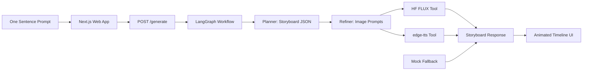

# UGC Storyboard Mini Demo Plan

## Scope

- Use the PRD at [PRD Agentic UGC Storyboard Generator (Mini Demo).md](PRD%20Agentic%20UGC%20Storyboard%20Generator%20%28Mini%20Demo%29.md) as the source of truth.
- Create a monorepo with [apps/web](apps/web) for the Next.js 15 frontend and [apps/api](apps/api) for the FastAPI backend.
- Implement hybrid generation: real Gemini/Hugging Face/TTS pipeline when env vars are available, deterministic mock storyboard/media fallback when they are missing or a generation step fails.

## Architecture

## Frontend Plan

- Scaffold [apps/web](apps/web) with Next.js App Router, TypeScript, Tailwind, shadcn/ui, Framer Motion, and Lucide.
- Build a dark-first single-page experience in [apps/web/app/page.tsx](apps/web/app/page.tsx): hero, large prompt input, sample prompt chips, generate button, agent pipeline loading state, and results area.
- Add focused components under [apps/web/components](apps/web/components): prompt composer, pipeline progress, storyboard timeline, scene card, audio controls, and JSON export action.
- Keep the visual direction product-like rather than generic AI SaaS: dark studio surface, one committed accent color, clear storyboard rhythm, strong mobile layout, accessible contrast, and reduced-motion fallbacks.

## Backend Plan

- Scaffold [apps/api](apps/api) with FastAPI, Python 3.11+, LangGraph, LangChain Google GenAI, Hugging Face Hub, edge-tts, and static file serving for generated assets.
- Add [apps/api/main.py](apps/api/main.py) with `POST /generate`, CORS for the local/web frontend, static serving from [apps/api/generated](apps/api/generated), and health check.
- Add workflow modules under [apps/api/app](apps/api/app): schema models, planner node, refiner node, image tool, TTS tool, mock generator, and orchestration graph.
- Store the PRD system prompt as a backend constant or prompt file, preserving the required output contract: `title`, `total_duration_sec`, and `scenes[]` with `script_text`, `visual_description`, and `image_prompt`.

## Hybrid Fallback Behavior

- If `GOOGLE_API_KEY` exists, try the real planner/refiner path. If it is missing or returns invalid JSON, use mock storyboard data.
- If `HF_TOKEN` or image inference fails, return stable placeholder/sample images with the generated prompt metadata preserved.
- If `edge-tts` fails, return scenes without audio URLs and let the UI show a disabled audio state instead of breaking the result page.
- Include clear response metadata such as `mode: "real" | "partial" | "mock"` so the UI can label the demo honestly.

## Setup And Verification

- Add root scripts for installing and running both apps, likely via npm workspaces plus a Python virtual environment guide in [README.md](README.md).
- Add `.env.example` files for [apps/web](apps/web) and [apps/api](apps/api) with `NEXT_PUBLIC_API_BASE_URL`, `GOOGLE_API_KEY`, and optional `HF_TOKEN`.
- Verify with backend schema tests for valid mock and partial responses, frontend type checks/build, and a local end-to-end run: enter prompt, see pipeline animation, receive timeline, play available audio, export JSON.

## Deployment Notes

- Frontend deploy target: Vercel from [apps/web](apps/web).
- Backend deploy target: Hugging Face Space, preferably Docker SDK for FastAPI because the PRD calls for a Python API service rather than a Gradio app.
- Keep generated files ephemeral for the mini demo. If persistence becomes important later, add durable storage rather than relying on local `generated/` files.